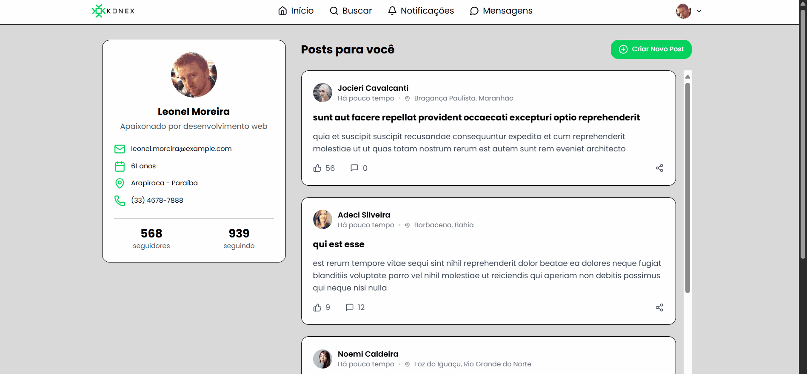

# Desafio Frontend - Knex Empresa Júnior


Projeto desenvolvido como parte do processo seletivo para a vaga de estágio em desenvolvimento Frontend da Knex Empresa Júnior. A aplicação consiste em um CRUD (Create, Read, Update, Delete) de posts, consumindo dados de usuários da [RandomUser API](https://randomuser.me/) e posts da [JSONPlaceholder](https://jsonplaceholder.typicode.com/).

---

### 🚀 **Aplicação em Funcionamento (Deploy)**

Você pode acessar a aplicação ao vivo através do seguinte link:

**[https://seu-link-de-deploy.vercel.app/](https://seu-link-de-deploy.vercel.app/)**

---

### 🎬 **Demonstração em Vídeo (GIF)**



---

## 📋 Índice

- [Descrição do Projeto](#-descrição-do-projeto)
- [Funcionalidades](#-funcionalidades)
- [Tecnologias Utilizadas](#-tecnologias-utilizadas)
- [Como Executar o Projeto](#-como-executar-o-projeto)
- [Como Rodar os Testes](#-como-rodar-os-testes)
- [Processo de Design](#-processo-de-design)
- [Autor](#-autor)

---

## 📝 Descrição do Projeto

O objetivo deste desafio foi desenvolver uma tela de rede social que realiza as quatro operações de um CRUD de posts. A aplicação busca um usuário aleatório para simular um perfil "logado" e exibe uma lista de posts. O usuário pode criar, editar, visualizar e deletar posts, com validações em tempo real e feedbacks visuais claros para uma ótima experiência de usuário.

---

## ✨ Funcionalidades

- [x] **Visualização de Perfil:** Exibe informações de um usuário aleatório (foto, nome, email, etc.).
- [x] **Listagem de Posts:** Carrega e exibe uma lista de posts da API.
- [x] **CRUD Completo de Posts:**
    - **Create:** Formulário em modal para criação de novos posts com validação em tempo real.
    - **Read:** Visualização dos posts na tela principal.
    - **Update:** Modal de edição pré-preenchido para alterar posts existentes.
    - **Delete:** Confirmação para exclusão segura de um post.
- [x] **Validação de Formulário:** Feedbacks visuais e mensagens de erro claras usando Zod e React Hook Form.
- [x] **Tratamento de Estados:** Feedbacks visuais para estados de `loading`, `error` e `empty` (nenhum post).
- [x] **Persistência de Usuário:** O token do usuário é salvo em Cookies para simular persistência.
- [x] **Responsividade:** Layout adaptado para uma boa experiência em dispositivos móveis e desktops.
- [x] **Testes Automatizados:** Testes unitários e de integração para garantir a qualidade dos componentes e funcionalidades.

---

## 🛠️ Tecnologias Utilizadas

A construção deste projeto envolveu as seguintes tecnologias:

- **Frontend:**
    - **React:** Biblioteca principal para a construção da UI.
    - **TypeScript:** Para tipagem estática e um desenvolvimento mais seguro.
    - **Vite:** Ferramenta de build extremamente rápida.
    - **Tailwind CSS:** Para estilização rápida e responsiva baseada em utilitários.
- **Gerenciamento de Estado e Dados:**
    - **TanStack Query (React Query):** Para gerenciamento de estado de servidor, cache, e revalidação de dados.
- **Formulários e Validação:**
    - **React Hook Form:** Para gerenciamento de performance e estado de formulários.
    - **Zod:** Para validação de schemas com inferência de tipos.
- **Testes:**
    - **Vitest:** Framework de testes rápido e compatível com Vite.
    - **React Testing Library:** Para testar os componentes da forma como o usuário os utiliza.
- **Outros:**
    - **Axios:** Cliente HTTP para as requisições à API.
    - **js-cookie:** Para manipulação de Cookies.
    - **ESLint & Prettier:** Para garantir a consistência e qualidade do código.

---

## 🚀 Como Executar o Projeto

Para rodar este projeto localmente, siga os passos abaixo:

**Pré-requisitos:**

- [Node.js](https://nodejs.org/en/) (versão 18.x ou superior)
- [npm](https://www.npmjs.com/) ou [yarn](https://yarnpkg.com/)

```bash
# 1. Clone o repositório
git clone https://github.com/vitor200450/knex-selection-challenges.git

# 2. Navegue até o diretório do projeto
cd knex-selection-challenges/frontend/konex-front

# 3. Instale as dependências
npm install

# 4. Inicie a aplicação
npm run dev
```

Após executar `npm run dev`, a aplicação estará disponível em `http://localhost:5173` (ou outra porta indicada no seu terminal).

---

## 🧪 Como Rodar os Testes

Para executar os testes automatizados do projeto, utilize o seguinte comando:

```bash
npm run test
```

---

## 🎨 Processo de Design

O design da interface foi prototipado no **Figma**, focando em uma estrutura limpa e intuitiva, inspirada em redes sociais modernas.

**[Ver protótipo no Figma](https://www.figma.com/design/vvZs7XocJtJzFV2tyFIiU1/Konex-Rede-Social?node-id=0-1&t=wJjaK1601UFhyezZ-1)**

---

## 👨‍💻 Autor

Desenvolvido por **José Vitor do Nascimento Rodrigues**.

- **LinkedIn:** [https://www.linkedin.com/in/jose-vitor-nascimento/](https://www.linkedin.com/in/jose-vitor-nascimento/)
- **GitHub:** [https://github.com/vitor200450](https://github.com/vitor200450)

---
